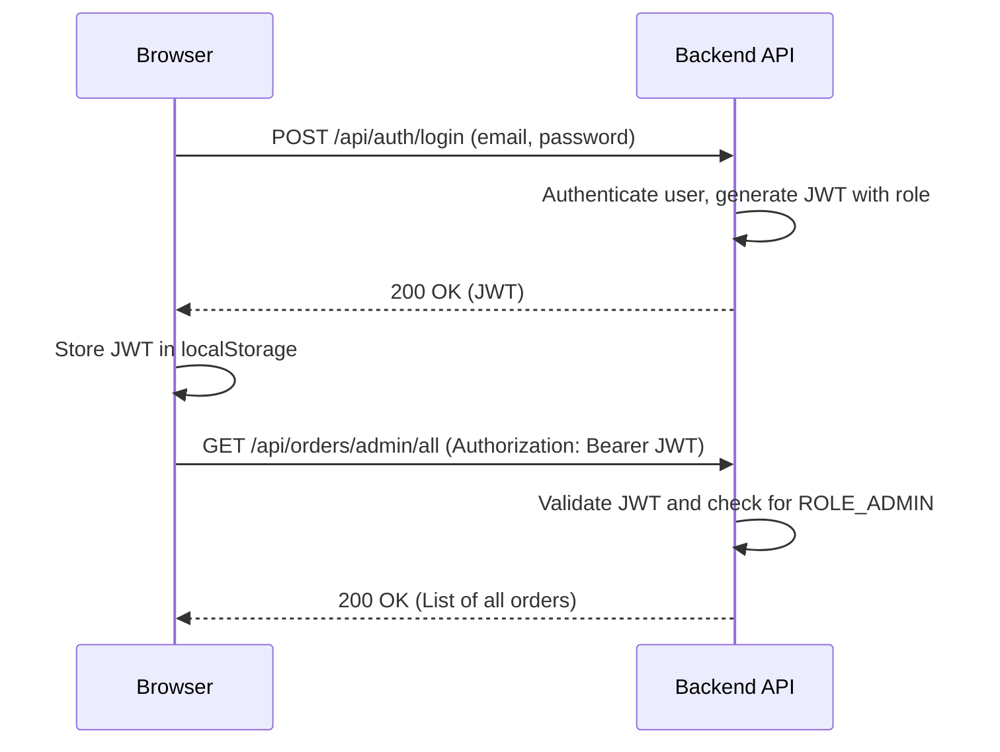

# Auntie's Kitchen - Frontend

This is the Angular frontend for the Auntie's Kitchen food order management system. It provides a comprehensive user interface for customers, cashiers, kitchen staff, and administrators to interact with the platform.

## Technologies Used
- **Angular 17**
- **TypeScript**
- **RxJS** for reactive programming
- **Angular Router** for navigation
- **Reactive Forms** for robust form handling

---

## Authentication Flow (JWT)

The application uses JSON Web Tokens (JWT) for securing the frontend and communicating with the backend API.

1.  **Login:** A user enters their credentials, which are sent to `POST /api/auth/login`.
2.  **Receive JWT:** The server validates the credentials and returns a JWT.
3.  **Store JWT:** The token is stored securely in the browser's `localStorage`.
4.  **Authorize Requests:** For all subsequent API calls to protected endpoints, the JWT is retrieved from `localStorage` and added to the `Authorization` header as a `Bearer` token. An `HttpInterceptor` handles this automatically.
5.  **Role-Based Access:** The JWT contains the user's role (e.g., `ROLE_ADMIN`, `ROLE_KITCHEN`), which the frontend uses to grant access to different dashboards and features.



---

## Features & Modules

This application is divided into several role-based modules.

### 1. Admin Dashboard (`/admin-dashboard`)

The central hub for all administrative tasks.

#### Manage Users
- **UI:** A full-width table displaying all users with the `CUSTOMER` role.
- **Features:**
    - **View Customers:** Fetches all users and filters for customers.
    - **Convert Role:** Admins can change a customer's role to `KITCHEN` or `CASHIER`. The user is then moved to the "Manage Staff" view.
    - **Auto-Refresh:** The user list automatically refreshes every 3 minutes.
    - **Create User:** Redirects to the main `/register` page.
- **Endpoints Used:**
    - `GET /api/admin/users`
    - `PUT /api/admin/users/{userId}/role`
    - `DELETE /api/admin/users/{userId}`

#### Manage Staff
- **UI:** A two-column layout showing a list of all staff (`ADMIN`, `KITCHEN`, `CASHIER`) and a form to create new staff members.
- **Features:**
    - **View Staff:** Displays all non-customer users.
    - **Create Staff:** A form to create new users with staff roles.
    - **Update Role:** Change a staff member's role between `KITCHEN` and `CASHIER`.
    - **Secure Admin Promotion:** Promoting a user to `ADMIN` requires a two-step OTP verification process for security.
- **Endpoints Used:**
    - `GET /api/admin/users`
    - `POST /api/admin/users`
    - `PUT /api/admin/users/{userId}/role`
    - `POST /api/admin/promote/initiate`
    - `POST /api/admin/promote/confirm`

#### Manage Orders
- **UI:** A spacious, full-width view with powerful filtering/sorting controls and a grid of order cards.
- **Features:**
    - **View All Orders:** Displays every order in the system.
    - **Filtering & Sorting:** Filter by customer name or order status; sort by date or total price.
    - **Auto-Refresh:** The order list updates every minute.
    - **Detailed View:** Clicking an order opens a large modal with complete details, including the customer's name and items.
- **Endpoints Used:**
    - `GET /api/orders/admin/all`

#### Manage Menu
- **UI:** A two-column layout with a menu item list and a form for adding/editing items.
- **Features:** Full CRUD (Create, Read, Update, Delete) functionality for menu items.
- **Endpoints Used:**
    - `GET /api/menu`
    - `POST /api/menu`
    - `PUT /api/menu/{id}`
    - `DELETE /api/menu/{id}`

### 2. Kitchen Dashboard (`/kitchen-dashboard`)

A real-time Kitchen Display System (KDS) designed for high-traffic environments.

- **UI:** A Kanban-style board with columns for each order status: `Pending`, `Confirmed`, `Preparing`, and `Ready for Pickup`.
- **Features:**
    - **Live Order View:** Displays all active kitchen orders in their respective status columns.
    - **Auto-Refresh:** The board updates every 20 seconds.
    - **Sound Notification:** A sound plays whenever a new order arrives.
    - **Workflow Management:** Kitchen staff can advance an order to the next stage with a single click (e.g., "Start Preparing").
    - **Automatic Removal:** Orders marked as `COMPLETED` are automatically removed from the board.
- **Endpoints Used:**
    - `GET /api/orders/kitchen`
    - `PUT /api/orders/{orderId}/status`

### 3. Cashier Dashboard (`/cashier-dashboard`)

The Point of Sale (POS) interface for cashiers to create new orders. *(Note: This module is planned and not yet implemented).*

- **Planned Features:**
    - **Create Orders:** For both registered customers and guests.
    - **Quick Item Search:** Use `menuCode` to quickly add items to an order.
    - **Customer Lookup:** Search for registered customers to attach to an order.
- **Planned Endpoints:**
    - `POST /api/orders`
    - `GET /api/menu/search`
    - `GET /api/admin/users/search`

### 4. Customer Dashboard (`/customer-dashboard`)

A personal dashboard for registered customers. *(Note: This module has not been reviewed or modified yet).*

- **Planned Features:**
    - View personal order history.
    - Track the status of current orders.
- **Planned Endpoints:**
    - `GET /api/orders/customer`

---

## Getting Started

1.  **Install Dependencies:**
    ```bash
    npm install
    ```
2.  **Run Development Server:**
    ```bash
    ng serve
    ```
    Navigate to `http://localhost:4200/`. The application will automatically reload if you change any of the source files.
